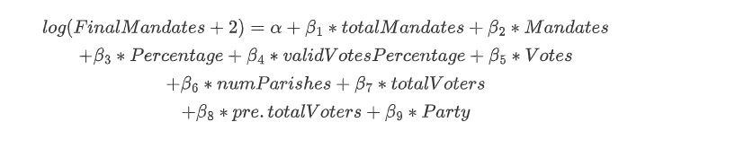
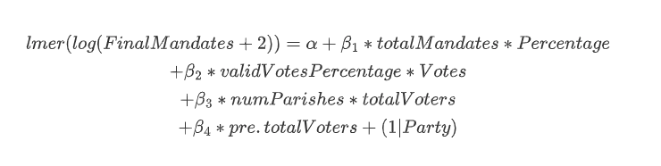

```{r setup, include=FALSE}
knitr::opts_chunk$set(
	#echo = TRUE,
	fig.align = "center",
	message = FALSE,
	warning = FALSE,
	echo=FALSE,
	dev = "png"
)

library(readr)
library(ggplot2)
library(tidyverse)
library(knitr)
library(kableExtra)
library(lme4)
library(arm)
library(coefplot)
library(dplyr)
library(leaflet)
library(reshape2)
library(lmerTest)
```

# Abstract

In the current political climate, understanding electoral dynamics is more important than ever. This report focuses on analyzing election data to predict final mandates awarded to political parties. Utilizing a comprehensive dataset, the analysis employs both Exploratory Data Analysis (EDA) and advanced statistical modeling to unravel the complexities of election results. The study delves into how various factors like vote percentages, total votes, and mandates impact the final distribution of seats among parties. This report aims to provide a deeper understanding of electoral behaviors and the significant variables influencing election outcomes. Readers will gain insights into the intricacies of mandate allocation and the predictive power of different electoral variables.

# Introduction

This project is centered around the examination of election data, aiming to comprehend the relationship between various electoral factors and the final mandates obtained by political parties. The analysis is rooted in a robust dataset, encapsulating a range of variables from vote percentages to the number of parishes within territories. The scope of this study spans multiple components, including data visualization, statistical modeling, and result interpretation. Initially, the report will conduct a thorough EDA to identify key predictors influencing the final mandates. Subsequently, the focus will shift to constructing multilevel models, considering factors such as political parties and territorial divisions. This comprehensive approach is designed to offer a nuanced understanding of electoral trends and the determinants of electoral success.

## Data Source

The dataset was sourced from the UCI Machine Learning Repository, specifically focusing on the real-time election results in Portugal for the year 2019. This comprehensive dataset can be accessed through the following URL:

<https://archive.ics.uci.edu/dataset/513/real+time+election+results+portugal+2019>

The data encapsulates detailed information from the 2019 Portuguese Parliamentary Elections, offering insights into the electoral process and outcomes. The timeframe covered in this dataset includes the duration of the election and the subsequent counting of votes. A total of 28 variables are included, encompassing various aspects such as the time elapsed since the first results, territory names, party details, total mandates, votes, and percentages, among others. These variables provide a granular view of the electoral dynamics, enabling a thorough analysis of how different factors influence the allocation of mandates to various political parties.This study aims to uncover the intricate relationships between different electoral factors and their impact on the final mandate distribution.

## Overview

```{r}
# Read the data
election_data <- read.csv("ElectionData.csv")  

election_data=na.omit(election_data)
#summary(election_data)  # Summary statistics
```

# EDA

## Variable Selection

These variables were picked based on their potential to provide significant insights into the dynamics of the election.

-   **Percentage**: This variable represents the percentage of total votes received by each party. It is a direct indicator of a party's popularity and electoral appeal, offering a snapshot of its overall performance in the election.

-   **ValidVotesPercentage**: The percentage of valid votes garnered by each party is crucial in understanding the effective support for the parties, excluding invalidated or blank votes. It refines the analysis by focusing on the votes that directly contribute to the allocation of mandates.

-   **Votes**: The total number of votes received by each party is the most straightforward measure of its electoral strength. This variable captures the raw voter support and serves as a foundation for further analysis.

-   **NumParishes**: Reflecting the total number of parishes in each territory, this variable provides context on the geographical and administrative complexities of the electoral areas, potentially influencing voting patterns.

-   **TotalVoters**: The number of voters who actually voted is a vital measure of voter turnout. This variable is essential for understanding the level of electoral engagement and participation in different regions.

-   **Pre.totalVoters**: Examining the total number of voters from previous elections allows for a comparative analysis, offering insights into changes in voter turnout and shifting political landscapes.

-   **FinalMandates**: As the ultimate outcome of the electoral process, the final number of mandates secured by each party is the pivotal measure of success. This variable encapsulates the culmination of electoral efforts and strategies.

```{r}

correlation_matrix <- cor(election_data[, c('Percentage', 'validVotesPercentage', 'Votes', 'numParishes', 'totalVoters', 'pre.totalVoters', 'FinalMandates')], use = "complete.obs")


correlation_matrix_melted <- melt(correlation_matrix)


ggplot(correlation_matrix_melted, aes(Var1, Var2, fill = value)) +
  geom_tile() +
  scale_fill_gradient2(low = "blue", mid = "yellow", high = "red", midpoint = 0, limit = c(-1,1)) +
  theme_minimal() +
  theme(axis.text.x = element_text(angle = 45, hjust = 1)) +
  labs(title = "Correlation Matrix of Selected Variables", x = "", y = "") +
  coord_fixed()
```

Notably, there is a high correlation between votes received by parties and the final mandates, suggesting that parties with more votes tend to secure more mandates. There's also a notable correlation between total and final mandates, indicating a strong link between initial allocation and final outcomes.

```{r}

party_avg_percentage <- election_data %>%
  group_by(Party) %>%
  summarise(Avg_Percentage = mean(Percentage, na.rm = TRUE)) %>%
  arrange(desc(Avg_Percentage))

ggplot(party_avg_percentage, aes(x = reorder(Party, Avg_Percentage), y = Avg_Percentage, fill = Party)) +
  geom_bar(stat = "identity") +
  scale_fill_viridis_d() + 
  theme(axis.text.x = element_text(angle = 90, hjust = 1)) +
  labs(title = "Average Percentage of Total Votes per Party", x = "Party", y = "Average Percentage of Votes")


```

This chart displays a small number of parties have a noticeably higher average percentage, indicating that they are leading in popularity and voter preference. The majority of parties, however, have a lower average vote percentage.

```{r}

party_avg_valid_votes <- election_data %>%
  group_by(Party) %>%
  summarise(Avg_ValidVotesPercentage = mean(validVotesPercentage, na.rm = TRUE)) %>%
  arrange(desc(Avg_ValidVotesPercentage))

ggplot(party_avg_valid_votes, aes(x = reorder(Party, Avg_ValidVotesPercentage), y = Avg_ValidVotesPercentage,fill = Party)) +
  geom_bar(stat = "identity") +
    scale_fill_viridis_d() + 
  theme(axis.text.x = element_text(angle = 90, hjust = 1)) +
  labs(title = "Average Percentage of Valid Votes per Party", x = "Party", y = "Average Percentage of Valid Votes")


```

Similar to the total vote percentage, the chart for valid votes shows a leading group of parties with a significantly higher average of valid votes. This reinforces the observation that a few parties tend to dominate the electoral landscape, with their votes not only numerous but also largely valid.

```{r}

party_total_votes <- election_data %>%
  group_by(Party) %>%
  summarise(Total_Votes = sum(Votes, na.rm = TRUE)) %>%
  arrange(desc(Total_Votes))

ggplot(party_total_votes, aes(x = reorder(Party, Total_Votes), y = Total_Votes,fill=Party)) +
  geom_bar(stat = "identity") +
  scale_fill_viridis_d() + 
  theme(axis.text.x = element_text(angle = 90, hjust = 1)) +
  labs(title = "Total Votes per Party", x = "Party", y = "Total Votes")

```

This bar chart clearly shows he leading party has a far greater total vote count compared to others, indicating a strong voter base. The rapid fall-off suggests that after a few dominant parties, the rest have significantly fewer votes.

```{r}

party_avg_final_mandates <- election_data %>%
  group_by(Party) %>%
  summarise(Avg_FinalMandates = mean(FinalMandates, na.rm = TRUE)) %>%
  arrange(desc(Avg_FinalMandates))

ggplot(party_avg_final_mandates, aes(x = reorder(Party, Avg_FinalMandates), y = Avg_FinalMandates, fill = Party)) +
  geom_bar(stat = "identity") +
  scale_fill_manual(values = rainbow(n = length(party_avg_final_mandates$Party))) +
  theme(axis.text.x = element_text(angle = 90, hjust = 1)) +
  labs(title = "Average Final Mandates per Party", x = "Party", y = "Average Final Mandates")

```

The pattern here is similar to the total votes chart, where a small number of parties have a distinctly higher number of average final mandates, reflecting their electoral success in terms of seat allocation.

```{r}

territory_avg_percentage <- election_data %>%
  group_by(territoryName) %>%
  summarise(Avg_Percentage = mean(Percentage, na.rm = TRUE)) %>%
  arrange(desc(Avg_Percentage))

ggplot(territory_avg_percentage, aes(x = reorder(territoryName, Avg_Percentage), y = Avg_Percentage, fill = territoryName)) +
  geom_bar(stat = "identity") +
scale_fill_viridis_d() + 
  theme(axis.text.x = element_text(angle = 90, hjust = 1)) +
  labs(title = "Average Percentage of Total Votes per Territory", x = "Territory Name", y = "Average Percentage of Votes")

```

The distribution of average vote percentages across territories appears more uniform than among parties.

## Time series analysis

```{r}

election_data$TimeElapsedHours <- election_data$TimeElapsed / 60


grouped_by_time <- election_data %>%
  group_by(TimeElapsedHours) %>%
  summarise(Average_Percentage = mean(Percentage, na.rm = TRUE),
            Average_FinalMandates = mean(FinalMandates, na.rm = TRUE),
            Average_Votes = mean(Votes, na.rm = TRUE))


ggplot(grouped_by_time, aes(x = TimeElapsedHours, y = Average_Percentage)) +
  geom_line(color = "blue") +
  labs(title = "Average Percentage of Total Votes Over Time", x = "Time Elapsed (Hours)", y = "Average Percentage of Votes") +
  theme_minimal()


ggplot(grouped_by_time, aes(x = TimeElapsedHours, y = Average_FinalMandates)) +
  geom_line(color = "green") +
  labs(title = "Average Final Mandates Over Time", x = "Time Elapsed (Hours)", y = "Average Final Mandates") +
  theme_minimal()


ggplot(grouped_by_time, aes(x = TimeElapsedHours, y = Average_Votes)) +
  geom_line(color = "red") +
  labs(title = "Average Total Votes Over Time", x = "Time Elapsed (Hours)", y = "Average Total Votes") +
  theme_minimal()

```

1.  Average Percentage of Total Votes Over Time: This graph shows a slight upward trend in the average percentage of total votes over time, with a small jump occurring early in the time series. After the initial increase, the percentage appears to stabilize with minor fluctuations. This suggests that as the vote counting progressed, there was a moment where the average percentage of votes for parties increased slightly, possibly indicating the reporting of results from a region where parties had stronger support.

2.  Average Final Mandates Over Time: The average final mandates plot exhibits a sharp drop early in the time series, followed by a period of stability. This sharp decrease could reflect the allocation of mandates based on the initial vote counts, which then stabilizes as additional votes are counted and the mandate distribution does not change significantly.

3.  Average Total Votes Over Time: This plot shows a gradual and consistent increase in the average total votes over time. The curve suggests a continuous accumulation of votes as results are reported. The absence of any drops or plateaus indicates that votes were tallied at a relatively constant rate throughout the time period represented.

```{r}

election_data$time <- as.POSIXct(election_data$time, format="%Y/%m/%d %H:%M")


election_data$color_factor <- as.factor(election_data$territoryName)

ggplot(election_data, aes(x = time, y = totalMandates, group = territoryName, color = color_factor)) +
  geom_line() +
  facet_wrap(~ territoryName, scales = "free_y") +  
  labs(title = "Total Mandates Over Time by Territory",
       x = "Time", y = "Total Mandates") +
  theme_minimal() +
  theme(axis.text.x = element_text(angle = 45, hjust = 1),  #
        strip.text.x = element_text(size = 8),  # 
        legend.position = "none") +  # 
  scale_color_manual(values = rainbow(n = length(unique(election_data$territoryName)))) # 

```

Based on the time series plot for "Total Mandates Over Time by Territory":

-   General Trend: Many territories show either a stable line or a slight fluctuation in total mandates as time progresses. This suggests that after initial results, the number of mandates per territory did not change significantly, which is common in an election once a substantial proportion of votes have been counted.

-   Varied Changes: Some territories, such as Porto, show an upward trend, which indicates an increase in the total number of mandates over time. In contrast, other territories like Bragança and Viana do Castelo show a downward trend, suggesting a decrease in mandates as more results were tallied.

-   Initial Drops and Stability: Territories like Aveiro, Coimbra, and Évora show an initial drop in mandates, followed by stability. This could be due to early results favoring one outcome that was later balanced out by results from other parishes within the territory.

-   Stability: Territories such as Leiria and Madeira display relatively flat lines, indicating no significant change in the mandate count over time, which could suggest that early results were quite representative of the final outcome.

-   Distinct Patterns: Some territories, such as Porto, exhibit distinct patterns with an increasing number of mandates over time, potentially reflecting late-reported results that favored additional mandates for certain parties.

# Model

```{r}

standardize <- function(x) {
  (x - mean(x, na.rm = TRUE)) / sd(x, na.rm = TRUE)
}

election_data <- election_data %>%
  mutate_at(vars(totalMandates, Mandates, Percentage, validVotesPercentage, Votes, numParishes, totalVoters, pre.totalVoters), standardize)
```

since the FinalMandates is Skewed distribution, I will use a log transformation, so in the model the response variable is log(FinalMandates+2),which is more close to the normal distribution

## Null Model

$$log(FinalMandates +2)=\alpha $$

```{r}
# Null Model
null_model <- lm(log(FinalMandates+2) ~ 1 , data = election_data)
#summary(null_model)

```

The intercept's estimate is approximately 0.87, suggesting that when no predictors are included, the log-transformed count of final mandates (offset by 2 to handle zero counts) is expected to be around this value. The extremely low p-value indicates that the intercept is significantly different from zero.

The residuals, or differences between observed and predicted values, show minimal variation, with the first and third quartiles being the same. The residual standard error (RSE) is approximately 0.48, providing a measure of the typical size of the residuals.

Overall, this null model indicates that, while we have a significantly non-zero intercept, the model does not explain any variability in the final mandates since no predictors are included.

## Complete pooling model



```{r}
# 
model_complete_pooling <- lm(log(FinalMandates+2) ~ totalMandates + Mandates + Percentage + validVotesPercentage +
                              Votes + numParishes + totalVoters + pre.totalVoters  + Party, 
                              data = election_data)
#summary(model_complete_pooling)
#plot(model_complete_pooling,which =c(1,2))#create a residual plot and Q-Q plot.
#coefplot(model_complete_pooling,title = "Coefficient plot for complete pooling model")
```

-   **Model Fit**: The model has a high Multiple R-squared value of approximately 0.837, indicating that around 83.7% of the variability in the log-transformed **FinalMandates** is explained by the model. This is a substantial amount, suggesting a good fit to the data.

-   **Residuals**: The residuals have a standard error of about 0.196, which is relatively low, suggesting that the model predictions are, on average, close to the actual log-transformed mandate counts.

## Negative Binomial model

since the mean and the variance is not equal, I will try the negative binomial model to fit.


```{r}

negbin_model <- glm.nb(log(FinalMandates+2) ~ totalMandates + Mandates + Percentage + validVotesPercentage +
                        Votes + numParishes + totalVoters + pre.totalVoters + Party ,
                        data = election_data)
#summary(negbin_model)
#plot(negbin_model,which =c(1,2))#create a residual plot and Q-Q plot.
#coefplot(negbin_model,title = "Coefficient plot for Negative binomial model")
```

-   **Model Fit**: The residual deviance is significantly lower than the null deviance, indicating that the model with predictors provides a better fit than the null model. The AIC of the model is 40270.

-   **Theta Parameter**: The model's theta parameter is quite large, indicating a high level of overdispersion in the data that the negative binomial model is accounting for.

## No pooling model


```{r}

model_no_pooling_party <- lm(log(FinalMandates+2) ~ totalMandates + Mandates + Percentage + validVotesPercentage +
                               Votes + numParishes + totalVoters + pre.totalVoters +factor(Party)-1, 
                               data = election_data)
#summary(model_no_pooling_party)

#plot(model_no_pooling_party,which =c(1,2))#create a residual plot and Q-Q plot.
#coefplot(model_no_pooling_party,title = "Coefficient plot for no pooling model")

```

-   **Model Fit**: The Multiple R-squared is approximately 0.9615, which is very high, indicating that the model explains a large portion of the variance in the log-transformed **`FinalMandates`**. The F-statistic is significantly large, and the associated p-value is less than 2.2e-16, indicating that the model fits the data well.

-   **Significance**: Almost all predictors are statistically significant, as indicated by the p-values.

-   **Residuals**: The residual standard error is around 0.196, and the residuals have a range suggesting some variability around the fitted values is still unexplained by the model. The median of the residuals is close to zero, indicating that the model does not have a systematic bias in its predictions.

## Partial Pooling model


```{r}
model_partial_pooling_party <- lmer(log(FinalMandates+2) ~ totalMandates + Mandates + Percentage + validVotesPercentage +
                                    Votes + numParishes + totalVoters + pre.totalVoters  + (1 | Party), 
                                    data = election_data)
#summary(model_partial_pooling_party)
#plot(model_partial_pooling_party,which =c(1,2))#create a residual plot and Q-Q plot.
#coefplot(model_partial_pooling_party,title = "Coefficient plot for partial pooling model")

```

-   **Fixed Effects**: In the fixed effects, **Mandates**, **Votes**, **numParishes**, **totalVoters**, and **pre.totalVoters** showing significant coefficients. A notable aspect is that both **totalMandates** and **Mandates** have negative effects, whereas **Votes** has a strong positive effect.

-   **Random Effects**: The random effect for **Party** has a very small variance, suggesting that there is minimal variability in the log-transformed **FinalMandates** between different parties that is not explained by the fixed effects. This could indicate that the fixed effects are capturing most of the differences between parties.

## Interaction



```{r}
model_with_interactions <- lmer(log(FinalMandates+2) ~ totalMandates * Percentage + validVotesPercentage * Votes +
                                numParishes * totalVoters + pre.totalVoters + (1 | Party),
                                data = election_data)
#summary(model_with_interactions)
#plot(model_with_interactions,which =c(1,2))#create a residual plot and Q-Q plot.
#coefplot(model_with_interactions,title = "Coefficient plot for interaction model")

```

-   **Interaction Effects**: All interaction terms are significant, with the interaction between **validVotesPercentage** and **Votes** showing a particularly strong negative effect. This suggests that the relationship between valid vote percentage and final mandates depends on the number of votes and vice versa. Similarly, **totalMandates** and **Percentage** is also negative and significant, indicating a complex relationship where the effect of one variable on the final mandates is moderated by the other.

-   **Fixed Effects**: **totalMandates** has a negative coefficient, while **validVotesPercentage** has a positive effect.

-   **Random Effects**: The random effect of **Party** is small, implying that the fixed effects and their interactions capture most of the variability in **FinalMandates** across parties.

## Analysis

### ANOVA

```{r}

anova_result_1 <- anova(model_partial_pooling_party, model_with_interactions)
anova_result_2 <- anova(model_complete_pooling, model_no_pooling_party)

# 将结果转换为数据框
anova_table_1 <- as.data.frame(anova_result_1)
anova_table_2 <- as.data.frame(anova_result_2)

row.names(anova_table_1)=c("partial","interaction")
kable(round(anova_table_1))


```

The ANOVA between random effect model shows that the model with interaction terms has a lower AIC and BIC compared to the partial pooling model without interactions, and the considerable Chi-squared statistic and the significant p-value indicate that the addition of interaction terms provides a substantially better fit to the data.

```{r}
#anova(null_model, model_complete_pooling, negbin_model, model_no_pooling_party)
```

### AIC and BIC

```{r}
aic_values <- c(AIC(model_complete_pooling), 
                AIC(model_partial_pooling_party), 
                AIC(model_with_interactions),
                AIC(negbin_model),AIC(model_no_pooling_party))

bic_values <- c(BIC(model_complete_pooling), 
                BIC(model_partial_pooling_party), 
                BIC(model_with_interactions),
                BIC(negbin_model),BIC(model_no_pooling_party))

model_names <- c("Complete Pooling", "Partial Pooling Party", "With Interactions", "NegBin Model","No Pooling Party")
comparison <- data.frame(Model = model_names, AIC = aic_values, BIC = bic_values)


kable(comparison)


```

Based on the anove, AIC, BIC, The interactions model is the best-performing model among those model.

### Prediction

In order to compare the prediction performance of the models, I divide the dataset into a training set and a test set, and then use each model to fit on the training set and make predictions on the test set. The principle to compare the predicted performance of a model is Mean Square Error (MSE), which is calculating the sum square of the absolute values of the difference between the predicted and true values.

```{r}

library(caret)
library(MASS)


set.seed(123)


index <- createDataPartition(election_data$FinalMandates, p = 0.8, list = FALSE)
train_data <- election_data[index, ]
test_data <- election_data[-index, ]


model_complete_pooling_train <- lm(log(FinalMandates+2) ~ totalMandates + Mandates + Percentage + validVotesPercentage + Votes + numParishes + totalVoters + pre.totalVoters + Party, data = train_data)
model_partial_pooling_party_train <- lmer(log(FinalMandates+2) ~ totalMandates + Mandates + Percentage + validVotesPercentage + Votes + numParishes + totalVoters + pre.totalVoters + (1 | Party), data = train_data)
model_with_interactions_train <- lmer(log(FinalMandates+2) ~ totalMandates * Percentage + validVotesPercentage * Votes + numParishes * totalVoters + pre.totalVoters + (1 | Party), data = train_data)
negbin_model_train <- glm.nb(log(FinalMandates+2) ~ totalMandates + Mandates + Percentage + validVotesPercentage + Votes + numParishes + totalVoters + pre.totalVoters + Party, data = train_data)
model_no_pooling_party_train <- lm(log(FinalMandates+2) ~ totalMandates + Mandates + Percentage + validVotesPercentage + Votes + numParishes + totalVoters + pre.totalVoters + factor(Party) - 1, data = train_data)


predictions_complete_pooling <- predict(model_complete_pooling_train, newdata = test_data)
predictions_partial_pooling_party <- predict(model_partial_pooling_party_train, newdata = test_data)
predictions_with_interactions <- predict(model_with_interactions_train, newdata = test_data)
predictions_negbin <- predict(negbin_model_train, newdata = test_data, type = "response")
predictions_no_pooling_party <- predict(model_no_pooling_party_train, newdata = test_data)


sum_abs_diff_complete_pooling <- sum(abs(predictions_complete_pooling - log(test_data$FinalMandates+2)))^2
sum_abs_diff_partial_pooling_party <- sum(abs(predictions_partial_pooling_party - log(test_data$FinalMandates+2)))^2
sum_abs_diff_with_interactions <- sum(abs(predictions_with_interactions - log(test_data$FinalMandates+2)))^2
sum_abs_diff_negbin <- sum(abs(predictions_negbin - log(test_data$FinalMandates+2)))^2
sum_abs_diff_no_pooling_party <- sum(abs(predictions_no_pooling_party - log(test_data$FinalMandates+2)))^2


results <- data.frame(
  Model = c("Complete Pooling", "Partial Pooling Party", "Interactions", "Negative Binomial", "No Pooling Party"),
  MSE = c(sum_abs_diff_complete_pooling, sum_abs_diff_partial_pooling_party, sum_abs_diff_with_interactions, sum_abs_diff_negbin, sum_abs_diff_no_pooling_party)
)


kable(results)

```

-   Based on the ANOVA, AIC, BIC, and the MSE of Prediction,the interactions model is the best-performing model among those model.

# Conclusion

### The best model conclusion

Based on the findings from the interaction model in this electoral study, the strategy of the model hinges on capturing the complex interactions between various electoral factors. This model structure, which includes both main effects and interaction terms, is adept at revealing the nuanced interplay of variables in predicting the log-transformed **FinalMandates**. The model's ability to accommodate these interactions minimizes the deviance, providing a more accurate and insightful analysis compared to simpler models.

From the analysis, the interaction terms emerge as the most influential components of the model. Particularly, the interaction between **totalMandates** and **Percentage** stands out, indicating that the effect of a party's total mandates on final mandates is significantly moderated by its percentage of total votes. This reflects a diminishing returns effect, where additional mandates have a reduced benefit for parties with a higher vote percentage.

Similarly, the negative interaction between **validVotesPercentage** and **Votes** highlights how the influence of valid votes on final mandates decreases for parties with a larger number of total votes. This suggests that for parties with substantial voter support, the proportion of valid votes becomes less critical.

Furthermore, the model reveals that a higher number of **Votes** and **numParishes** are directly associated with an increase in final mandates, emphasizing the importance of voter turnout and geographical spread in electoral success.

In conclusion, this model, with its intricate design, efficiently captures the complex dynamics of the electoral process. It underscores the importance of considering how different electoral factors interact with each other, providing a more comprehensive understanding of how various elements collectively influence election outcomes.

### Limitation

Reflecting on the limitations and potential enhancements of this study, it's important to note that the dataset focuses exclusively on election results from a specific context. Consequently, while the model excels in explaining the nuances of electoral mandates in this particular setting, its applicability to other electoral scenarios or different countries may be limited. The unique political landscape, voting systems, and party dynamics of other regions require separate consideration and analysis.

## References

1.  Dieter Stiers. Spatial and valence models of voting: The effects of the political context. Electoral Studies, 80:102549, 2022.

2.  <https://archive.ics.uci.edu/dataset/513/real+time+election+results+portugal+2019>
